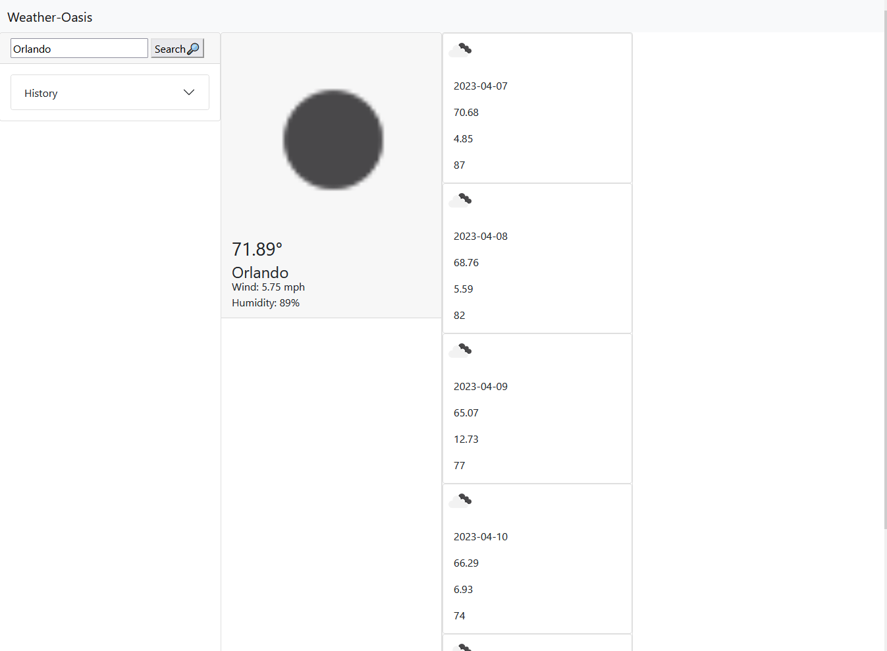

# Weather-Dashboard

## About

This is a Front-End Only 'Static' Application for Use as a `Weather Dashboard` 

## Table of Contents

- [Weather-Dashboard](#weather-dashboard)
  - [About](#about)
  - [Table of Contents](#table-of-contents)
  - [Description](#description)
  - [Preview](#preview)
  - [Installation](#installation)
  - [Tests](#tests)
  - [License](#license)

## Description

This `Weather Dashboard` is a Front-End application that empower users to sieze the day or even plan their upcoming week by showing them the forecast for the day and the week ahead. It uses `OpenWeather.com` to fetch data from it's Api. This application was developed to learn about fetching api's and working with their returned JSON data. This Application is a good starting point to flesh out into a module to be used in other applications, or to start a small news site from.

## Preview

The following Image Shows the Application in action:

  
  
## Installation

The Application is Deployed although you are able to clone it locally and mess with the endpoints yourself via live server or simply by opening the html in your favorite browser.

## Tests

N/A
  
## License

